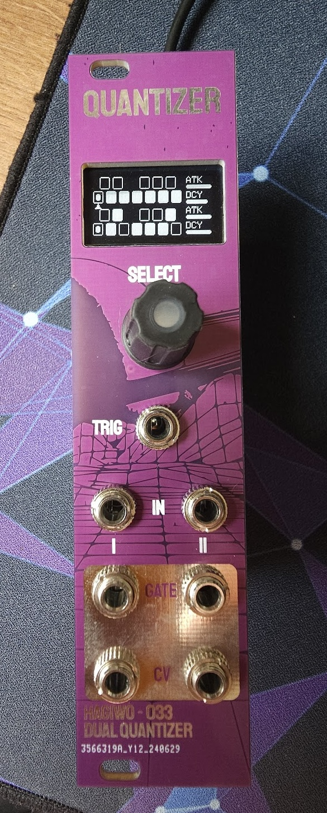

# Voltage Foundry Modular


This repository is a collection of Eurorack modules based on the fantastic work of Hagiwo and some of my creation. The modules are designed to be easy to build and modify and be built with through-hole components. The firmware is based on the Arduino platform.

The concept is to have some generic hardware with a display, rotary encoder, trigger inputs and output, CV inputs and outputs allowing different modules by changing the firmware.

The module's core uses a Seeeduino Xiao (SAMD21/Cortex M0 chip) and a MCP4725 DAC.

This project currently provides the following modules:

- Clock Generator
- Dual Quantizer
- Sequencer
- Generative Sequencer

Each new module firmware will be in a separate folder which can be built and uploaded to the Seeeduino Xiao using PlatformIO.


## Clock Generator

This module provides a clock generator with a display and a rotary encoder to select the BPM and the division of the clock signal. The module has 4 (four) trigger outputs. The module has a configuration screen to change the clock division/multiplication parameters for each output and tap-tempo functionality. All configurations can saved in the EEPROM memory in the SAVE menu.

Check details [here](./firmware-CLK/Readme.md) and the module [manual](./firmware-CLK/Manual.md).

### Interface

- TRIG: Optional Clock input (0-5V)
- IN1, IN2: CV input to control internal parameters (0-5V)
- GATE 1 / 2: Clock Outputs 1 and 2 (0-5V)
- CV 1 / 2: Clock Outputs 3 and 4 (0-5V)

### Operation

The main screen shows the current BPM and a square shows each output status. Pushing the encoder enables the BPM edit mode which can be changed from 10 to 300 BPM. Pushing the encoder again returns to the parameter selection mode.

Check the module's manual for more details.

## Dual Quantizer

This module is a dual quantizer with a display and a rotary encoder to select the scale and root note for each channel. The module has two CV inputs and two CV outputs with a trigger output for each channel. The module has an envelope generator for each channel with attack and decay parameters. The configuration screen allows changing the parameters for each channel and a preset screen to load predefined scales and notes for each channel.



### Interface

- TRIG: Trigger input (0-5V)
- IN1, IN2: CV input to be quantized (0-5V)
- GATE 1 / 2: Gate with envelope curve output for each channel (0-5V)
- CV 1 / 2: CV output with quantized scale output for each channel (CH1: 10bit, CH2: 12bit, 0-5V)

### Operation

Use the rotary encoder to select the parameter, and the push the switch to change parameters.
The upper half of the screen shows CH1, and the lower half CH2. Select the keyboard displayed as a rectangle to select the note for which quantization is enabled. Pushing the encoder enables or disables the selected note.
The parameters on the right of the screen are for setting the envelope generator. You can control the attack and decay of each CH that will be applied to Gate.

In the config screen, you can change the parameters for each channel.
SYNC: Selects what the envelope generator output is synchronized to. You can choose to output it simultaneously with the change in pitch, or simultaneously with the trigger voltage input to CLK IN.
OCT: Octave shift. Select from a range of -2 to +2 to shift the octave of the output pitch CV.
SENS: Sensitivity to CV input. Functions equivalent to an attenuator or amplifier.
SAVE: Saves each setting. Saved settings are loaded when the power is turned on.

Next screen allows loading pre-defined presets for scale and note to each channel.
SCALE: Selects which scale to use
ROOT: Selects the root note for choosen scale
LOAD CH1/CH2: Loads the selected Scale and Root into the channel overwriting the existing notes.

## Production specifications

- Eurorack standard 3U 6HP size
- Power supply: 30mA (at 5V)
- Module depth: 40mm
- On-board converter from 12V to internal 5V

Power supply can be select from an on-board jumper where closing the the SEL with REG jumper, will take power from eurorack 12V supply and closing the SEL with BOARD jumper, will take power from 5V (requires 16 pin cable). It can also be powered by the USB-C jack on the Seeeduino Xiao.

## Project State

- ✅ - Working
- ❎ - Not tested
- ❓ - In progress

| Firmware             | Support  |
| -------------------- | ---------|
| Hardware             |    ✅    |
| Clock Generator      |    ✅    |
| Dual Quantizer       |    ✅    |
| Sequencer            |    ❎    |
| Generative Sequencer |    ❎    |

## Simulations

- Clock Generator: [Link](https://wokwi.com/projects/403851982905059329)

## Hardware and PCB

You can find the schematic and BOM in the root folder.
For the PCBs, the module has one main circuit PCB, one control circuit PCB and one panel PCB. The files are available in the [gerbers](./gerbers/) directory.
You can order them on any common PCB manufacturing service, I used [JLCPCB](https://jlcpcb.com/). I made the circuits pcbs under 100mm to get the discount price.
Standard settings should be fine, but as there is exposed copper on the panel you should go with a lead free surface finish (ENIG/Leadfree HASL).
If the panel size is not correctly detected by JLC (happens on some of my exports) manually put 30x128.5 mm.

When ordering the display module, make sure to choose an 0.96 I2C oled module that has the pinout specified as GND-VCC-SCL-SDA as opposed to VCC-GND-SCL-SDA (both exist and the latter will fuck it up).

Also make sure you order a Seediuno XIAO (with a SAMD21/Cortex M0 chip) as opposed to the XIAO esp32c3 or the XIAO rp2040, those are different chips.


Pinout Diagram:

```text
|--------------------|
|                    |
|         O          |    1
|                    |
|   O           O    |  2   3
|                    |
|                    |
|   O           O    |  4   5
|                    |
|   O           O    |  6   7
|                    |
----------------------
```

- 1 - Trigger / Clock Input
- 2 - CV In 1
- 3 - CV In 2
- 4 - Trigger Out 1
- 5 - Trigger Out 2
- 6 - CV Out 1 (Internal DAC)
- 7 - CV Out 2 (External DAC)

## Assembly

When assembling, you can either use a header for the screen or solder it directly, as it is a litte too tall.
The 7805 voltage regulator is optional, if you do not want to use it, simply solder the SEL header on the back of the main pcb to BOARD instead of REG (meaning you bridge the connection to choose your 5v voltage source to either be 12 regulated to 5v, or a 5V connection of your rack power if you have it).

## Calibration

There are two things  in the circuit that need to be tuned for: The input resistor divider going from 5V to 3.3V, and the output opamp gain to go from 3.3 back to 5V.
I will provide a script to help with this and a detailed description in the future, but for now the short version is: Input resistors are compensated for in code with the AD_CH1_calb/AD_CH2_calb parameters. Output gain is adjusted using the trimmers on the main pcb.

Vin(5v) *(R21(33k)/R21(33k)+R19(18k) = Vout
5v:1 = Vout:a(AD_CH1_calb) (in my case AD_CH1_calb = 0.971)

3.3v to 5v(scale up)
5v/3.3v = 1.51515
0.51515 = 5k(adjustable)/6.8k

## Acknowledgements

The initial [hardware](./Hardware/) is based on Hagiwo 033 module. The quantizer base code is from the [original](https://note.com/solder_state/n/nb8b9a2f212a2) Hagiwo 033 Dual Quantizer and the updated thru-hole project by [Testbild-synth](https://github.com/Testbild-synth/HAGIWO-029-033-Eurorack-quantizer). Some ideas for the clock module were "taken" from the [LittleBen module](https://github.com/Quinienl/LittleBen-Firmware) from Quinie.nl.
